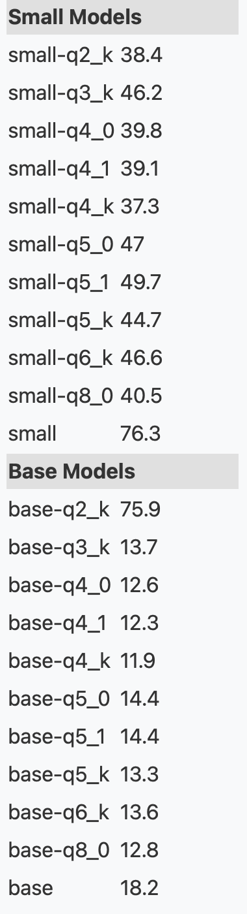

### Goal / Story

We aim to achieve running speech recognition models on low-power devices like raspberry Pi.

This is part of bigger framework for smart office/home, user of which wants a device to record a meeting, transcribe it, and send the transcription to meeting participants' emails, for example. Due to security reasons, the transcription is to be done on device instead of server.

We need the model to:
1. To be fast enough to do real-time speech transcription
2. To be robustly accurate

So far we came across such models as whisper (c++ implementation), moonshine. Only smallest whiper model is feasable to be run on rPi (RTF: 0.77) and it's not as robust as desired. Moonshine is currently our baseline (RTF: 0.2). Other models are signifficantly slower.

As main usage of a model is going to be on a streaming mode, we strongly believe that getting to run Kuytai model on rPi would be very nice (as it's innovation is best for streaming). We prefer higher accuracy over lower RTF (as long as it's still runnable on rPi with other not resource-demanding programss).

*In case sections below are confusing, or you want to replicate them yourself, or you want to have more details, please take a look at my [weekly notes](https://dakpro.github.io)*

----

### Setup
Setup: rasberryPi 4 (ARM CPU), 4gb RAM, headless setup(no screen connected).

1. Clone repo from git
2. Install rust
3. Setup:
```
cd stt-rs
sudo apt install libssl-dev
export PKG_CONFIG_PATH=/usr/lib/aarch64-linux-gnu/pkgconfig
```
4. Running
```
cargo run -r ../audio/bria.mp3
```

----

<!--### Building time

Finished `release` profile [optimized + debuginfo] target(s) in 29m 52s

------>

### Runtime

Though the model parameters are almost 2 GB, the whole model takes about 4.2 GB of ram, thus
when running on rPi with 4 GB RAM, the process gets killed due to running out of RAM.

I used memory swapping (using micro-SD as RAM) to counter that.

----

### Transcription timings

(ignored) Downloading the model: 3 mins

Time to start transcribing first word: 5 mins 51s

Time to translate continue translating the whole 5s recording: 50s

*Much of the overhead is introduced by memory access bottleneck, which also includes usage of sd-card as RAM, which can be signifficantly decreased if model itself gets quantized.*

Typical usage of CPU resources during the transcription phase:


----

### Quantization

After quantization, models of whisper (that already fitted into the memory, no sd usage was needed) used twice less time for Q4-K quantization *(Note: the evaluation of the whisper models was done on an 11s audio)*:


