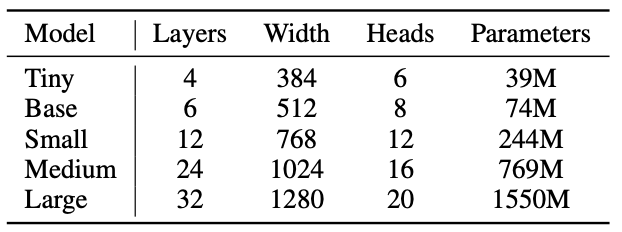

## Whisper
Went through the paper on Whisper - speech recognition model from OpenAI.

It's open source and available on GitHub.

Many models are available to choose from:

Choice of model:
1. By taking into account other processes running on the device -- better for deployment
2. Customizable by user?
<i>There can be some custom vocabulary/promting added to the model -- interesting what it can be achieved with it.</i>
Training dataset is 2/3 english and 1/3 uneven mix, but model's "knowledge" is transferable across the languages (for instance slavic languages parts enhance each other).
***
Installed both whisper and whisper.cpp on Mac
***
Ran transcription with whisper
***
Ran transcription with whisper.cpp
***

<code>sox -d \<filename\></code>
nice tool to record audio
-d stands for default input device

## rPi

Tried to set up the rPI. The system didn't boot. Turns out it's the problem with the rPi itself - it didn't read from the SD card (indication of no reading: no green LED blinking, only red).

Got new board - gives green light

## new rPi

Booting rPi with 64-bit standart (not headless) OS.
<i>for production and further testing - headless (Lite) version should be tested as it's smaller and faster than the standart OS.</i>

### Connecting Mac to the rPi ssh via ethernet via switch
! don't forget about setting host when writing OS to the SD-card

<i>just figured out you can update bootloader with the same sd - just different stuff needs to be loaded on it. Could I fix the "broken" rPi by updating the boot? (to be done)</i>

1. connect both rPi and Mac to an ethernet switch (NetGear GS108 in my case)

<i>Had problem with detecting connection from rPi to the switch.</i>

2. When using ethernet on Mac, one should add the ethernet as service. (Done in *Settings/Network*)

3. To make the connection work, one should make static IP addresses on the connection for both Mac and rPi

For Mac:
<ol>
  <li> goto Settings/Network/Apple Adapter(or how else you named the service) -> Details -> TCP/IP tab
  <li> change configure ipv4 to manual
  <li> Input the static address (I chose 192.168.5.1)
  <li> Subnet mask is left 255.255.0.0, other empty fields are left empty
</ol>

For standart rPi setup:
<ol>
    <li> Click on the double-arrow network symbol in the top right corner
    <li> Advanced Options/Edit Connections/Wired Connection X/IPv4 Settings/
    <i> note: previously set Link negotiation on Wired Connection X/Ethernet to Automatic - what has it fixed??
    </i>
    <i> also set cloned MAC address to Permanent - not sure I completely understand what it does </i>
    <li>. Set *Method* to *Manual*
    <li>. *Add*
    <li>. Set parameters (192.168.5.2, 24, 192.168.5.1 for me (not sure what 24 does))
    <li>. Save
    <li>. Reboot the rPi
</ol>

For headless rPi setup:**TODO**

Finally, we got the working rPi-Mac connection

To verify: turn off wifi and try
<code>ping raspberrypi.local</code>
Or even try to login (on my rPi I made user = "user"):
<code>ssh user@raspberrypi.local</code>
Also ensure in .ssh/known_hosts there's no entry for raspberrypi.local, as there exists a  with such URL, thus when you try to connect to ssh for the first time the website is accessed.

### Connecting rPi to eduroam via wlan

needs to be done via loading configuration as /etc/wpa_supplicant/wpa_supplicant.conf:
<code>
network={
  ssid="eduroam"
  key_mgmt=WPA-EAP
  eap=PEAP
  identity="<token name>"
  password="<password>"
  phase1="peaplabel=0"
  phase2="auth=MSCHAPV2"
  ca_cert="<pathToCertificate>"
  priority=1
}
</code>

restarting the service:
<code>  sudo killall wpa_supplicant
sudo wpa_supplicant -B -i wlan0 -c /etc/wpa_supplicant/wpa_supplicant.conf
sudo dhclient wlan0
</code>

check by
<code>
iwgetid
ping 1.1.1.1
</code>

### Ran whisper.cpp on rPi

Took ~18s to transcribe 11s audio.
Lite OS optimization wouldn't be that effective + other processes are to be run in the background.

Before thinking on optimization decided to run kyutai, as if kyutai is 5 times faster, optimization efforts are wasted.

## Kyutai

Alternative model: kyutai

* Smaller, better performance than whisper
* Inputs stream instead of recording, thus much better for live transcription
* Only English and French

Trying to run kyutai model on rPi

<ol>
<li> Clone repo from git
<li> Install rust
<li> cd stt-rs
<li> sudo apt install libssl-dev
<li> export PKG_CONFIG_PATH=/usr/lib/aarch64-linux-gnu/pkgconfig
<li> cargo run -r ../audio/bria.mp3
</ol>
<i>takes a long to build - haven't tried with <code>uv</code> though </i>

<i> github guide also includes "--features cuda" in the last stage, but as there's no gpu on rPi, it's been removed </i>

Problem: kyutai is too big and thus cannot fit into 3.3 RAM -> the process gets killed

sudo install python-msgpack
