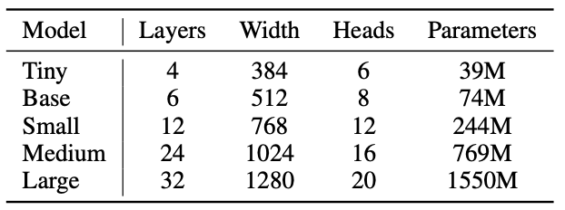

## Day 1

Went through the paper on Whisper.

> Which model should we use:
> 
> For very low-power devices, the tiny model is expected to work, but what if base/small work?
>> Choice of model:
>> 1. By taking into account other processes running on the device -- better for deployment
>> 2. Customizable -- more flexibility

> There can be some custom vocabulary/promting added to the model -- interesting what it can be achieved with it.

<!-- > Training dataset is 2/3 english and 1/3 uneven mix, but model's "knowledge" is transferable across the languages (for instance slavic/germanic/romanic languages parts enhance each other). -->
***
Installed both whisper and whisper.cpp
***
Ran transcription with whisper
***
Ran transcription with whisper.cpp
***

>     sox -d \<filename\>
>  nice tool to record audio
> -d stands for default device

---

## Day 2

Alternative model: kyutai

* Smaller, better performance than whisper
* Inputs stream instead of recording
* Only English and French

---

Tried to set up the rPI. The system didn't boot. Turns out it's the problem with the rPi itself - it didn't read from the SD card (indication of no reading: no green LED blinking, only red).

Got new board - gives green light

---

## Day 3

Booting rPi with 64-bit standart (not headless) OS.
> for production and further testing - headless (Lite) version should be tested as it's smaller and faster than the standart OS.

---

### Connecting to the rPi ssh via ethernet (on Mac)

> ! don't forget about setting host when writing OS to the SD-card

> just figured out you can update bootloader with the same sd - just different stuff needs to be loaded on it. Could I fix the "broken" rPi by updating the boot? (to be done)

1. connect both rPi and Mac to an ethernet switch (NetGear GS108 in my case)

> Had problem with detecting connection from rPi to the switch.

2. When using ethernet on Mac, one should add the ethernet as service. (Done in *Settings/Network*)

3. To make the connection work, one should make static IP addresses on the connection for both Mac and rPi

* For Mac:
  1. goto *Settings/Network/Apple Adapter(or how else you named the service) -> Details -> TCP/IP tab*
  2. change *configure ipv4* to manual
  3. Input the static address (I chose 192.168.5.1)
  4. Subnet musk is left 255.255.0.0, other empty fields are left empty

* For rPi:
  * For monitor system
    1. Click on the double-arrow network symbol in the top right corner
    2. Advanced Options/Edit Connections/Wired Connection X/IPv4 Settings/
    > note: previously set Link negotiation on Wired Connection X/Ethernet to Automatic - what has it fixed??

    > also set cloned MAC address to Permanent - not sure I completely understand what it does
    3. Set *Method* to *Manual*
    4. *Add*
    5. Set parameters (192.168.5.2, 24, 192.168.5.1 for me (not sure what 24 does))
    6. Save
    7. Reboot the rPi

  * For headless system:**TODO**

Finally, we got the working rPi-Mac connection

> To verify: turn off wifi and try

>       ping raspberrypi.local

> Or even try to login (on my rPi I made user = "user"):

>       ssh user@raspberrypi.local

>  Also ensure in .ssh/known_hosts there's no entry for raspberrypi.local
---

Connected to eduroam via wlan

> needs to be done via loading configuration as /etc/wpa_supplicant/wpa_supplicant.conf:

      network={
        ssid="eduroam"
        key_mgmt=WPA-EAP
        eap=PEAP
        identity="<token name>"
        password="<password>"
        phase1="peaplabel=0"
        phase2="auth=MSCHAPV2"
        ca_cert="<pathToCertificate>"
        priority=1
      }

> clearing the service:

      sudo killall wpa_supplicant

  > and then

      sudo wpa_supplicant -B -i wlan0 -c /etc/wpa_supplicant/wpa_supplicant.conf
      sudo dhclient wlan0

> check by

      iwgetid
      ping 1.1.1.1

---

Ran whisper.cpp on rPi

Took ~18s to transcribe 11s audio.
> could be optimized is using lite OS?

---

## Day 3

Trying to run kyutai model on rPi

1. Clone repo from git
2. Install rust
3. cd stt-rs
4. sudo apt install libssl-dev
5. export PKG_CONFIG_PATH=/usr/lib/aarch64-linux-gnu/pkgconfig
6. cargo run -r ../audio/bria.mp3

> takes a long to build

> github guide also includes "--features cuda", but as there's no gpu on rPi, it's been removed.

---

Problem: kyutai is too big and thus cannot fit into 3.3 RAM -> the process gets killed

---

sudo install python-msgpack
