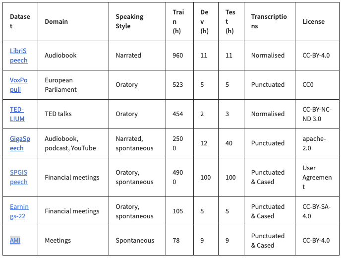

## Week 3

(Note: this blog will be updated throughout the week)

<code>nvidia/parakeet-tdt_ctc-110m</code> - cannot be run on rPi:
when trying to run the program, it just exits after a while at the point of importing the
<code>nemo.collections.asr</code>.

As discovered later on, all nvidia models require nvidia GPU to run. Thus we are left with
<code>moonhsine</code>.

Also came across <code>vosk</code> and <code>faster-whisper</code> which are interesting to try.

### Results and Comparison:

#### Moonshine tiny

And so my fellow Americans ask not what your country can do for you, ask what you can do for your country.

#### Moonshine/base

And so my fellow Americans ask not what your country can do for you ask what you can do for your country

<table>
    <tr>
        <th> Model</th>
        <th> 11s transcription time </th>
        <th> Word Error Rate </th>
    </tr>
    <tr>
      <td> whisper.cpp/base </td>
      <td> 21 s </td>
      <td> 10.32 </td>
    </tr>
    <tr>
      <td> whisper.cpp/base-Q4_K </td>
      <td> 12.6 s </td>
      <td> -- </td>
    </tr>
    <tr>
      <td> Moonshine/base </td>
      <td> 2.76 s </td>
      <td> 9.99 </td>
    </tr>
    <tr>
      <td> whisper.cpp/tiny </td>
      <td> 8.3 s </td>
      <td> 12.81 </td>
    </tr>
    <tr>
      <td> Moonshine/tiny </td>
      <td> 1.48 s </td>
      <td> 12.65 </td>
    </tr>
</table>

### Connecting microphone to rPi

Just connect it via USB.
Run <code>arecord -l</code> to see information about connected audio devices, say card X and device Y.

To make it a default audio input device (strongly recommended), add this into ~/.asoundrc:
<pre><code>
pcm.!default{
    type hw
    card X
}

ctl.!default{
    type hw
    card X
}
</code></pre>

You can test it with
<pre><code>
# record
arecord -D plughw:X,Y -f cd -t wav -d 5 test.wav
# play
aplay test.wav
</code></pre>

### Moonshine in streaming mode
Simple demo:
<pre><code>
git clone https://github.com/moonshine-ai/moonshine
uv pip install numba
uv pip install -r moonshine/demo/moonshine-onnx/requirements.txt
sudo apt update
sudo apt upgrade -y
sudo apt install -y portaudio19-dev
# run:
python3 moonshine/demo/moonshine-onnx/live_captions.py
</code></pre>

### Testing on realisticly long audios

<caption>Datasets used for the <a href="https://huggingface.co/spaces/hf-audio/open_asr_leaderboard">model leaderboard</a></caption>

From the listed above, I chose SPGISpeech, Earnings-22, and AMI for evalutaion of a model, as the model will be mostly used during meetings.

The raw datasets are can be included
