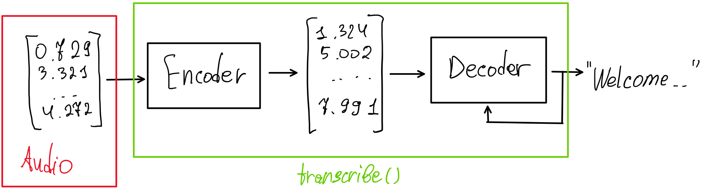

# Week 6

[Happy Linux birthday! (25 Aug)](https://www.reddit.com/r/linux/comments/1mz4gb4/happy_34th_birthday_linux/)

[Happy Ukraine independence day! (24 Aug)](https://en.wikipedia.org/wiki/Independence_Day_of_Ukraine)

[Happy Ukrainian Flag day! (23 Aug)](https://en.wikipedia.org/wiki/Day_of_the_National_Flag_(Ukraine))

## Difference between Whisper and Moonshine

Due to it's architecture and training, Whisper accepts only chunks of 30s. Thus when you try real-time speech recognition, for instance so that chunks of 2s are processed at once, it automatically appends 28s of zeroes. As a result you have to perform computation as of 30s on 2s chunk.

Both Whisper and moonshine are encoder-decoder transformers. Their simplified structure:

In Whisper, vector passed into an encoder must always correspond to 30s audio (otherwise WER [signifficantly increases](https://arxiv.org/pdf/2410.15608#page=3)).

Key difference in Moonshine is that it has type of encoder that uses Rotary Position Embeddings, so it handles inputs of varied lengths (and thus is trained on such).

*Though moonshine is much faster for streaming, its largest currently awailable model(base) has RTF~=0.3. If a whisper model has higher WER but still can transcribe 30s chunks in less than 30s, one could use whisper during meetings(where low latency is not required) for better better transcriptions*

## Updates on pipeline
- Extended evaluation script: now it accepts more models using regex. (useful for e.g. quantization, model finetunings)
- New metric: RTF (real-time factor = transcription time / audio length) - evaluates RTF on a given audio chunk.
*Note: many models have different RTFs depending on the audio length.*
- Optimized moonshine/file_trans so it doesn't reload model/tokenizer every time an audio is called (useful for evaluation).
- Added Vosk. It's used as a library, so its pipeline is quite trivial. Key differences between Vosk and models considered before:
    - Vosk uses Neural Networks and Hidden Markov Models instead of encoder
    - Vosk outputs are lowercase and exclude punctuation

## Table of evaluated models

*RTF* - Real-Time Factor = transcription time / audio length.

*sRTF* - Streaming Real-Time Factor =  transcription time / speech length.

*UPL* - User Perceived Latency, or latency = average time it takes for a spoken word to get displayed. For models with
segmental transcription, the result for the start of a segment is taken.

| Model               | sRTF on rPi 4 | RTF on rPi 4 | UPL*, seconds |
|---------------------|---------------|--------------|---------------|
| Moonshine  (base)   | 0.28-0.35 (1) | 0.64         | 0.2 + 0.2×RTF |
| Whisper.cpp (tiny)  | 30xRTF/X **   | 0.39 (2)     | X + 30×RTF    |
| Whisper.cpp (base)  | same as above | 0.74 (2)     | same as above |
| Whisper.cpp (small) | same as above | 2.44 (2)     | same as above |
| Kuytai              | \>1           | 10           | not feasible  |

UPL* - listed UPLs are theoretical and valid only if RTF on device is < 1.
Formulas for values are given using standard configuration of models (read below for more details).

** - streaming on whisper model works by recording audio for X (default: 0.5) seconds and then
transcribing it. The architecture transcribes audio in 30 s chunks only, thus sRTF depends on X.
In combination with UPL explanation, X just defines balance between UPL and sRTF.

(1) - Lower RTFs were observed on more consistent/faster speeches.
(2) - RTF for whisper depends on length of an audio being transcribed. The RTF evaluation is done on 90s audio sample,
as due to "30s-input-only" architecture constraint whisper gives highest RTFs on audios with length divisible by 30.
